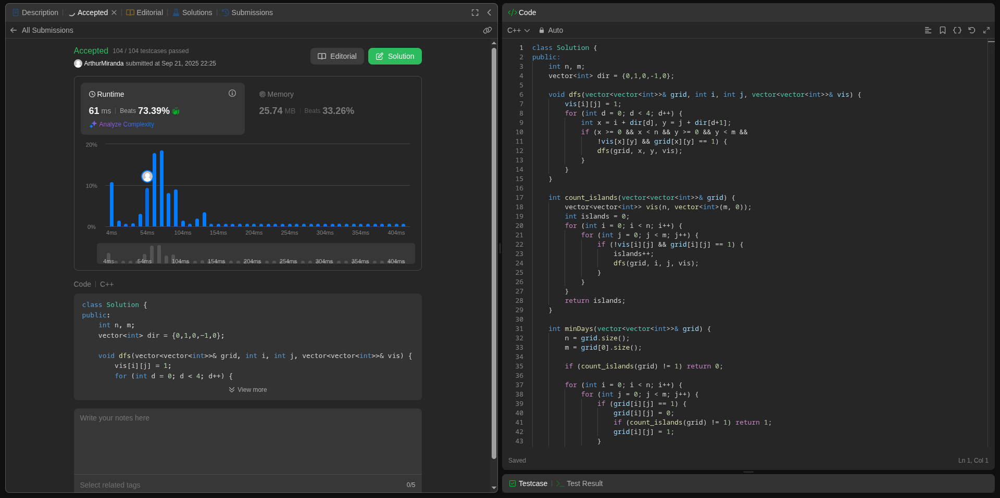

# Grafos2_Dupla15
Repositório destinado ao trabalho de grafos 2 da disciplina de Projeto de Algoritmos

**Número da Lista**: 15

**Conteúdo da Disciplina**: FGA0124 - PROJETO DE ALGORITMOS - T02  

## Alunos

<table>
  <tr>
    <td align="center"><a href="https://github.com/gabrieladouradof"> <b>Gabriela Dourado</b></a> </td>
    <td align="center"><a href="https://github.com/arthur-suares"> <b>Arthur Suares </b></a> 
  </tr>
</table>

| Matrícula   | Aluno                              |
| ----------- | ---------------------------------- |
| 23/1026821  | Gabriela Dourado França            |
| 21/1062651  | Arthur Miranda Suares              |

---
### Aprensentação

---
### Screenshots de submissões

[Exércicio 1568 - Minumum Number Of Days To Disconnect Island - Difícil](https://leetcode.com/problems/minimum-number-of-days-to-disconnect-island/description/?envType=problem-list-v2&envId=strongly-connected-component)

---

Segundo exercício (Difícil) - Find Critical and PseudoCritical Edges in Minimum Spaning Tree
(https://leetcode.com/problems/find-critical-and-pseudo-critical-edges-in-minimum-spanning-tree/description/)
---

Terceiro exercício (Médio) - 1584. Min Cost to Connect All Points 
(https://leetcode.com/problems/min-cost-to-connect-all-points/)
---

### Linguagem

Foram utilizadas as linguagens `python 3` e `c++`

---
